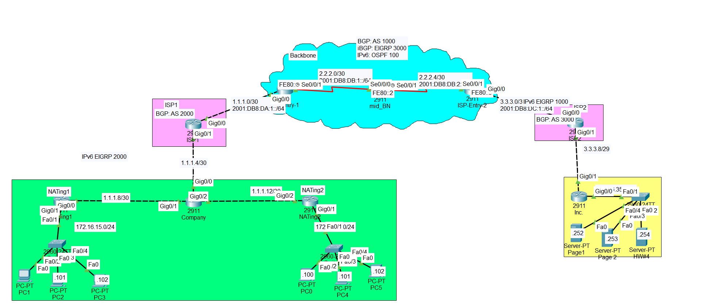

# 🌐 Enterprise Network Design (IPv4/IPv6, BGP, NAT) – Packet Tracer

This project demonstrates the design and implementation of a **multi-protocol enterprise network** using Cisco Packet Tracer.

It integrates:
- IPv4 & IPv6 dual-stack networking
- BGP and IGP interaction
- NAT (Static & Overload)
- Multi-domain routing design

---

## 🖼️ Network Topology

---

## 🎯 Project Objectives

1. Configure IPv4 and IPv6 on all interfaces  
2. Emulate **BGP for IPv6 using an alternative routing protocol**  
3. Ensure ISPs:
   - Do NOT have knowledge of internal client networks  
4. Enable communication between:
   - Green network PCs → Yellow network servers  
   - Without using static routes on ISPs  
5. Maintain **IPv6 connectivity ONLY between ISP1 and ISP2**  
6. Ensure proper network design and scalability  

---

## ⚙️ Network Components

### 🔵 Backbone Network
- Acts as the core infrastructure
- Uses:
  - BGP (AS 1000)
  - Internal routing (EIGRP / OSPF)
- Handles inter-ISP communication

---

### 🟪 ISP Networks

#### ISP1 (AS 2000)
#### ISP2 (AS 3000)

- Provide connectivity to enterprise networks
- Do NOT store internal routes of clients
- Exchange routing information via backbone

---

### 🟩 Green Network (Enterprise LAN)

- Internal company network
- Uses:
  - IPv4 + IPv6
  - NAT Overload (PAT)

#### NAT Routers:
- `NATing1`
- `NATing2`

👉 Purpose:
- Translate private IPs → public IPs
- Allow outbound communication

---

### 🟨 Yellow Network (Server Network)

- Contains internal servers:
  - Web / services

#### Router:
- `Inc_NATing`

Configured with:
- Static NAT
- Port Address Translation

👉 Purpose:
- Allow external access to internal servers

---

## 🧠 Key Concepts Demonstrated

- Dual-stack networking (IPv4 + IPv6)
- BGP design across multiple AS
- IGP + BGP interaction
- NAT Overload (PAT)
- Static NAT & Port Forwarding
- Route isolation (ISP design constraint)
- Enterprise network segmentation

---

## 🔄 Routing Design

### IPv4
- Full end-to-end connectivity required
- Achieved using:
  - NAT
  - BGP
  - Internal routing protocols

### IPv6
- Connectivity ONLY between:
  - ISP1 ↔ ISP2
- No internal IPv6 exposure to clients

---

## 🔥 Special Design Challenges

- ISPs cannot see internal networks  
- No static routes allowed on ISPs  
- Must rely on:
  - NAT
  - Proper routing design  

👉 This simulates real-world ISP behavior

---

## 📁 Files

- `network.pkt` → Packet Tracer project
- `network-topology.png` → Network diagram

---

## ▶️ How to Use

1. Open `network.pkt` in Cisco Packet Tracer  
2. Inspect router and switch configurations  
3. Verify routing tables:
   - `show ip route`
   - `show ipv6 route`  
4. Test connectivity:
   - IPv4 → End-to-end (PC → Server)
   - IPv6 → ISP1 ↔ ISP2 only  

---

## 📊 Marking Scheme

| Task | Weight |
|------|-------|
| Backbone configuration | 30% |
| ISP configuration | 30% |
| Green network (NAT Overload) | 25% |
| Yellow network (Static NAT + PAT) | 15% |

---

## 👤 Author

Hussain Alibrahim

---

## 💡 Notes

- Designed to simulate real-world enterprise + ISP architecture  
- Focus on scalability, isolation, and routing correctness  
- Demonstrates CCNA/CCNP-level networking skills  
